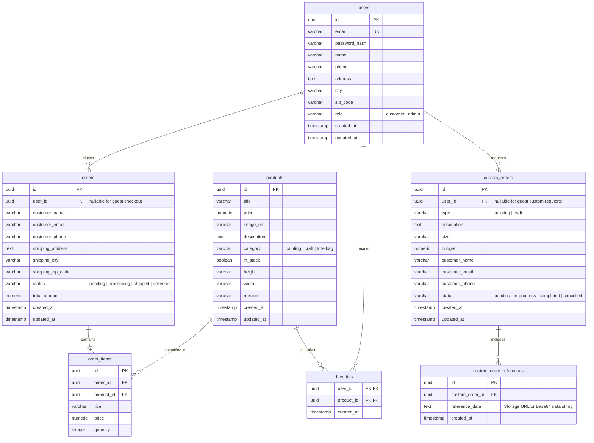

# Database Schema Document - Exotika Creation

This document outlines a production-ready relational database schema (PostgreSQL-compatible) designed to transition the Exotika Creation app from mock-state contexts to a persistent database backend.

---

## 1. Entity-Relationship Diagram (ERD)



---

## 2. Table Definitions

### 2.1. `users` Table
Stores authentication details and default delivery info for customers and admin users.

| Column | Type | Constraints | Description |
| :--- | :--- | :--- | :--- |
| `id` | `UUID` | `PRIMARY KEY`, `DEFAULT gen_random_uuid()` | Unique identifier. |
| `email` | `VARCHAR(255)` | `UNIQUE`, `NOT NULL` | User sign-in email. |
| `password_hash` | `VARCHAR(255)` | `NOT NULL` | Hashed password. |
| `name` | `VARCHAR(100)` | `NOT NULL` | Display/shipping name. |
| `phone` | `VARCHAR(20)` | `NULL` | Contact phone number. |
| `address` | `TEXT` | `NULL` | Default shipping address. |
| `city` | `VARCHAR(100)` | `NULL` | Shipping city. |
| `zip_code` | `VARCHAR(20)` | `NULL` | Postal code. |
| `role` | `VARCHAR(20)` | `NOT NULL`, `DEFAULT 'customer'` | Access levels: `customer`, `admin`. |
| `created_at` | `TIMESTAMP` | `DEFAULT CURRENT_TIMESTAMP` | Signup timestamp. |
| `updated_at` | `TIMESTAMP` | `DEFAULT CURRENT_TIMESTAMP` | Last modified timestamp. |

### 2.2. `products` Table
Holds metadata for inventory items.

| Column | Type | Constraints | Description |
| :--- | :--- | :--- | :--- |
| `id` | `UUID` | `PRIMARY KEY`, `DEFAULT gen_random_uuid()` | Unique identifier. |
| `title` | `VARCHAR(255)` | `NOT NULL` | Product name. |
| `price` | `NUMERIC(12,2)` | `NOT NULL`, `CHECK (price >= 0)` | Price in ₹ (INR). |
| `image_url` | `VARCHAR(1024)` | `NOT NULL` | URL to catalog image file. |
| `description` | `TEXT` | `NULL` | Detailed description of the product. |
| `category` | `VARCHAR(50)` | `NOT NULL` | Filters: `painting`, `craft`, `tote-bag`. |
| `in_stock` | `BOOLEAN` | `NOT NULL`, `DEFAULT TRUE` | Availability flag. |
| `height` | `VARCHAR(50)` | `NULL` | Dimensions height (paintings only). |
| `width` | `VARCHAR(50)` | `NULL` | Dimensions width (paintings only). |
| `medium` | `VARCHAR(100)` | `NULL` | Painting medium (e.g. Acrylic on Canvas). |
| `created_at` | `TIMESTAMP` | `DEFAULT CURRENT_TIMESTAMP` | Record creation. |
| `updated_at` | `TIMESTAMP` | `DEFAULT CURRENT_TIMESTAMP` | Record update. |

### 2.3. `favorites` Table (Many-to-Many Join)
Maps users to their bookmarked/favorited catalog items.

| Column | Type | Constraints | Description |
| :--- | :--- | :--- | :--- |
| `user_id` | `UUID` | `FOREIGN KEY REFERENCES users(id) ON DELETE CASCADE` | The user who favorited the product. |
| `product_id` | `UUID` | `FOREIGN KEY REFERENCES products(id) ON DELETE CASCADE` | The favorited product. |
| `created_at` | `TIMESTAMP` | `DEFAULT CURRENT_TIMESTAMP` | Date favorited. |

*Primary Key is compound: `(user_id, product_id)`.*

### 2.4. `orders` Table
Captures standard transaction headers.

| Column | Type | Constraints | Description |
| :--- | :--- | :--- | :--- |
| `id` | `UUID` | `PRIMARY KEY`, `DEFAULT gen_random_uuid()` | Unique identifier. |
| `user_id` | `UUID` | `FOREIGN KEY REFERENCES users(id) ON DELETE SET NULL` | Logged-in user, `NULL` if guest. |
| `customer_name` | `VARCHAR(255)` | `NOT NULL` | Shipping contact name. |
| `customer_email`| `VARCHAR(255)` | `NOT NULL` | Shipping contact email. |
| `customer_phone`| `VARCHAR(20)` | `NOT NULL` | Contact number. |
| `shipping_address`| `TEXT` | `NOT NULL` | Delivery physical address. |
| `shipping_city` | `VARCHAR(100)` | `NOT NULL` | Delivery city. |
| `shipping_zip_code`| `VARCHAR(20)` | `NOT NULL` | Delivery postal code. |
| `status` | `VARCHAR(50)` | `NOT NULL`, `DEFAULT 'pending'` | States: `pending`, `processing`, `shipped`, `delivered`. |
| `total_amount` | `NUMERIC(12,2)` | `NOT NULL` | Sum total of the order items. |
| `created_at` | `TIMESTAMP` | `DEFAULT CURRENT_TIMESTAMP` | Checkout timestamp. |
| `updated_at` | `TIMESTAMP` | `DEFAULT CURRENT_TIMESTAMP` | Last status modification. |

### 2.5. `order_items` Table
Captures lines of products purchased inside a transaction.

| Column | Type | Constraints | Description |
| :--- | :--- | :--- | :--- |
| `id` | `UUID` | `PRIMARY KEY`, `DEFAULT gen_random_uuid()` | Unique identifier. |
| `order_id` | `UUID` | `FOREIGN KEY REFERENCES orders(id) ON DELETE CASCADE` | Parent order reference. |
| `product_id` | `UUID` | `FOREIGN KEY REFERENCES products(id) ON DELETE SET NULL` | Reference to catalog. |
| `title` | `VARCHAR(255)` | `NOT NULL` | Snapshot of product title at purchase. |
| `price` | `NUMERIC(12,2)` | `NOT NULL` | Snapshot of product price at purchase. |
| `quantity` | `INTEGER` | `NOT NULL`, `CHECK (quantity > 0)` | Quantity purchased. |

### 2.6. `custom_orders` Table
Tracks user requests for customized commission artworks.

| Column | Type | Constraints | Description |
| :--- | :--- | :--- | :--- |
| `id` | `UUID` | `PRIMARY KEY`, `DEFAULT gen_random_uuid()` | Unique identifier. |
| `user_id` | `UUID` | `FOREIGN KEY REFERENCES users(id) ON DELETE SET NULL` | Logged-in requester, `NULL` if guest. |
| `type` | `VARCHAR(50)` | `NOT NULL` | Class: `painting`, `craft`. |
| `description` | `TEXT` | `NOT NULL` | Creative description of requested art. |
| `size` | `VARCHAR(100)` | `NULL` | Requested dimensions/parameters. |
| `budget` | `NUMERIC(12,2)` | `NOT NULL`, `CHECK (budget >= 4000)` | User budget (Minimum ₹4,000 INR). |
| `customer_name` | `VARCHAR(255)` | `NOT NULL` | Request name. |
| `customer_email`| `VARCHAR(255)` | `NOT NULL` | Contact email. |
| `customer_phone`| `VARCHAR(20)` | `NOT NULL` | Contact phone. |
| `status` | `VARCHAR(50)` | `NOT NULL`, `DEFAULT 'pending'` | States: `pending`, `in-progress`, `completed`, `cancelled`. |
| `created_at` | `TIMESTAMP` | `DEFAULT CURRENT_TIMESTAMP` | Submission timestamp. |
| `updated_at` | `TIMESTAMP` | `DEFAULT CURRENT_TIMESTAMP` | Last status override. |

### 2.7. `custom_order_references` Table
Holds the reference images submitted with a custom request.

| Column | Type | Constraints | Description |
| :--- | :--- | :--- | :--- |
| `id` | `UUID` | `PRIMARY KEY`, `DEFAULT gen_random_uuid()` | Unique identifier. |
| `custom_order_id`| `UUID` | `FOREIGN KEY REFERENCES custom_orders(id) ON DELETE CASCADE` | Associated request ID. |
| `reference_data` | `TEXT` | `NOT NULL` | Image URL or base64 binary encoding string. |
| `created_at` | `TIMESTAMP` | `DEFAULT CURRENT_TIMESTAMP` | File upload timestamp. |

---

## 3. Recommended Database Indexes
For optimal search performance under heavy traffic loads, the following indexes are recommended:

```sql
-- Indexes for looking up users
CREATE INDEX idx_users_email ON users(email);

-- Index for catalog queries by category
CREATE INDEX idx_products_category ON products(category);

-- Index for ordering history lookups
CREATE INDEX idx_orders_user ON orders(user_id);
CREATE INDEX idx_custom_orders_user ON custom_orders(user_id);

-- Compound index for fast wishlist rendering
CREATE UNIQUE INDEX idx_favorites_user_product ON favorites(user_id, product_id);
```

---

## 4. Prisma Mapping & Type-Safe Operations

For this backend implementation, we use **Prisma ORM** as the database abstraction layer. Below is the mapping from the logical table definitions to type-safe Prisma models, matching the backend's `schema.prisma` configuration:

*   **Prisma Client Generation**: The database client is generated automatically via the `prisma-client-js` generator.
*   **Enums**: Native PostgreSQL enums (`Role`, `Category`, `OrderStatus`, `CustomOrderStatus`) are mapped to Prisma `enum` constructs.
*   **Relations**:
    *   `User` ➔ One-to-Many with `Order`, `CustomOrder`.
    *   `Order` ➔ One-to-Many with `OrderItem`.
    *   `Favorites` ➔ Many-to-Many relationship between `User` and `Product` represented via explicit join table relations.
*   **Referential Actions**:
    *   `ON DELETE CASCADE` is set on children (e.g., `Favorite`, `OrderItem`, `CustomOrderReference`) when parent models (`User`, `Product`, `Order`, `CustomOrder`) are deleted.
    *   `ON DELETE SET NULL` is applied where historical transactional metadata must persist (e.g., `Order.user_id` when a `User` account is deleted).

For the full Prisma code schema, refer to [BACKEND_PLAN.md](file:///c:/Users/aksha/OneDrive/Documents/Projects/Exotika/docs/BACKEND_PLAN.md#L62-L210).

