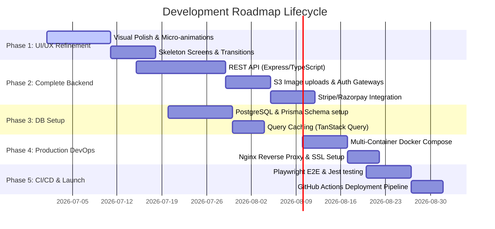

# Project Roadmap & Implementation Plan - Exotika Creation

This implementation plan outlines the steps required to transition **Exotika Creation** from a client-side mockup to a production-ready, secure, and containerized e-commerce application.

---

## Roadmap Phases Overview

---

## Detailed Phases

### Phase 1: UI/UX Refinement
**Goal:** Deliver a premium, visually engaging interface using modern web design principles and standardized UI library blocks.
*   **shadcn/ui Integration:** Initialize the shadcn CLI (`npx shadcn-ui@latest init`) to configure the global design system tokens, CSS variables, and paths. Create the `/src/components/ui` directory to hold clean, accessible component wrappers.
*   **Component Migration:** Replace custom, non-standard layout/form components with modular shadcn/ui inputs, buttons, tables, alert-dialogs, cards, and select elements to ensure consistent appearance, focus indicators, and access metrics.
*   **Typography & Colors:** Incorporate premium font hierarchies (e.g., *Playfair Display* for headers, *Geist* for body texts) and custom HSL color-token scales in `tailwind.config.js`.
*   **Micro-interactions:** Add interactive hover transformations on product cards, animated drawer sliders for the shopping cart (using Vaul or Framer Motion), and toast notifications.
*   **Skeleton Screens:** Replace basic spinners with CSS-shimmering skeletons for loading state placeholders on [Paintings](file:///c:/Users/aksha/OneDrive/Documents/Projects/Exotika/src/pages/Paintings.tsx), [Crafts](file:///c:/Users/aksha/OneDrive/Documents/Projects/Exotika/src/pages/Crafts.tsx), and [ToteBags](file:///c:/Users/aksha/OneDrive/Documents/Projects/Exotika/src/pages/ToteBags.tsx) using the shadcn/ui Skeleton primitive.
*   **Refinement of Profile views:** Make past order cards expandable to show shipping progress bars.

---

### Phase 2: Full Backend Integration
**Goal:** Construct a secure, type-safe API server to manage application data. For a complete folder structure, file setup, dependencies, and code definitions, refer to the [BACKEND_PLAN.md](file:///c:/Users/aksha/OneDrive/Documents/Projects/Exotika/docs/BACKEND_PLAN.md).
*   **Technology Choice:** Node.js + Express + TypeScript matching the language ecosystem of the frontend.
*   **Routing & Controllers:** Build controllers mirroring the frontend contexts, conforming to the [REST API specifications](file:///c:/Users/aksha/OneDrive/Documents/Projects/Exotika/docs/BACKEND_PLAN.md#4-rest-api-endpoint-specifications):
    *   `POST /api/auth/register`, `POST /api/auth/login` (JWT cookie session authentication).
    *   `GET /api/products` (supports query pagination, sorting, category filtering).
    *   `POST /api/orders` (initiates checkout, registers payment parameters).
    *   `POST /api/custom-orders` (handles multi-part reference photo uploads).
*   **Media Storage:** Set up an on-prem **MinIO** S3-compatible object storage container as specified in the [Media Storage Strategy](file:///c:/Users/aksha/OneDrive/Documents/Projects/Exotika/docs/BACKEND_PLAN.md#45-custom-commissions-routes-apicustom-orders) to host high-res image files locally.
*   **Payment Gateway Integration:** Implement sandbox/simulated payment checkout logic locally for full on-prem deployments, with configurable routing for Stripe/Razorpay webhooks.

---

### Phase 3: Database & State Migration
**Goal:** Replace temporary React memory contexts with a SQL database.
*   **Database Setup:** Spawn a PostgreSQL instance matching our [Database Schema](file:///c:/Users/aksha/OneDrive/Documents/Projects/Exotika/docs/DATABASE_SCHEMA.md).
*   **ORM Integration:** Implement **Prisma** or **TypeORM** for migrations and SQL queries.
*   **Frontend Data Fetching:** Replace React `useReducer` states with **TanStack (React) Query** for global server state management, caching database inquiries to improve performance and decrease API latency.

---

### Phase 4: Production Multi-Container Devops Setup
**Goal:** Build a containerized, self-healing, multi-service network.
*   **Docker-Compose Production Plan:** Maintain a production-ready `docker-compose.yml` comprising isolated containers:
    1.  **frontend-service**: Builds static Vite artifacts served by Nginx with client-side cache control headers.
    2.  **backend-service**: Node.js Express API runtime exposing port `8080`.
    3.  **db-service**: PostgreSQL engine backed by persistent named Docker volumes.
    4.  **object-storage-service**: On-prem **MinIO** S3-compatible storage with visual dashboard console.
    5.  **reverse-proxy (Nginx/Envoy)**: External entry point (port `80`/`443`) that routes traffic (`/api/*` ➔ backend, `/*` ➔ frontend, optional `/minio/*` ➔ MinIO) and integrates Certbot for SSL/TLS certificates.
*   **Security hardening:** Remove standard docker-compose port mappings to the database, ensuring database access is isolated strictly inside the internal Docker network.

---

### Phase 5: Automated Testing, CI/CD & Launch
**Goal:** Automate code integration checks and deployments.
*   **Automated Tests:**
    *   **Backend:** Write Jest unit tests for controllers and middleware.
    *   **Frontend E2E:** Write Playwright regression tests for the complete checkout and custom request flows.
*   **CI/CD Pipeline:** Create a GitHub Actions workflow:
    1.  Triggered on merges to the `main` branch.
    2.  Lints code, runs unit tests, and builds Docker images.
    3.  Pushes images to Docker Hub or AWS ECR.
    4.  Triggers a remote SSH deploy script updating container images on the target VM (e.g. AWS EC2 or DigitalOcean Droplet).
*   **Production Monitoring:** Add Sentry error tracing in both frontend and backend projects, and setup Winston/Morgan logs rotating inside the backend service.
